# macOS-Inspired Portfolio Website

Welcome to my **macOS-inspired portfolio**! This interactive project is designed to showcase my skills, projects, and creativity, mimicking the sleek, user-friendly macOS interface. Explore the various features below and get to know more about me through this unique experience.

---

## 🖥️ Introduction Window
The first screen you encounter is the **Introduction Window**, where you can learn about the purpose of this portfolio and how to navigate through the macOS-inspired UI.  
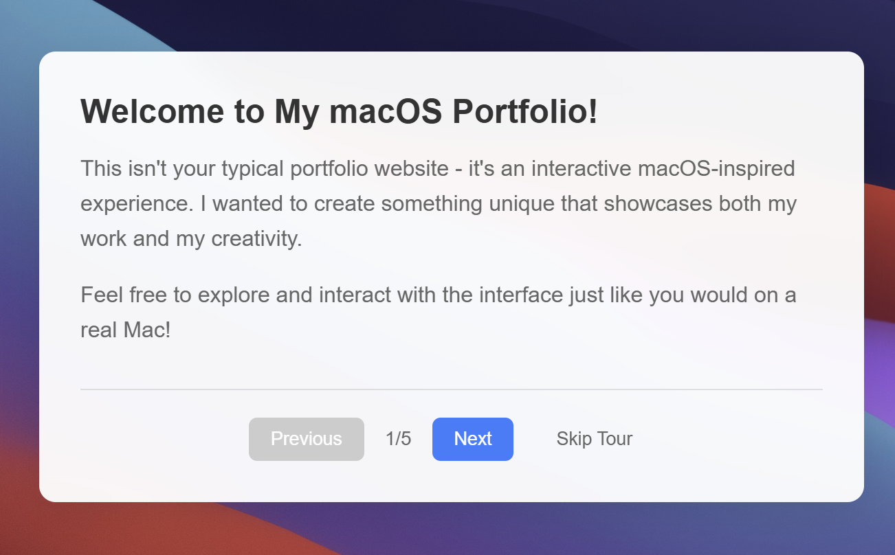  
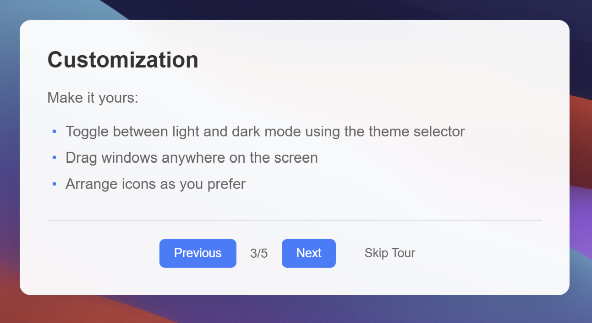  

---

## 📜 Menu Bar
The **Menu Bar** offers essential features for navigating the portfolio, designed with macOS aesthetics in mind.  
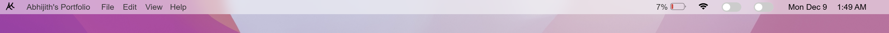  
**left end** 
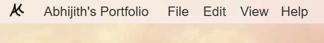  
**right end**
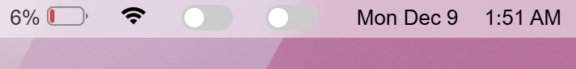

### Key Features in the Menu Bar:
- **Help Dropdown**: A handy guide on how the UI works, in case you forget later.  
  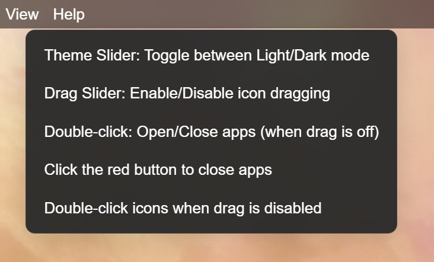  
- **Dynamic Battery Icon and Percentage**: Displays your current battery level.  
- **Dummy Wi-Fi SVG**: A simple decorative addition to the menubar.
- **Two Sliders**:  
  1. **Enable/Disable App Dragging**: Control whether icons can be dragged around.  
     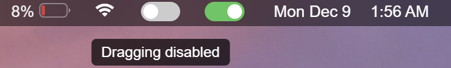  
  2. **Dark/Light Theme Selector**: Switch between light and dark modes with ease.  
     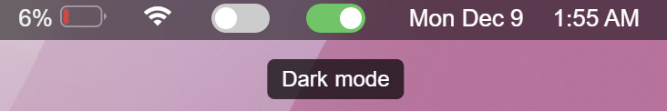  
- **Current Date and Time**: Displays the dynamic date, time, and day of the week.  

---

## 📂 Applications
The portfolio includes interactive **apps**, each opening in its own window for an immersive experience:  

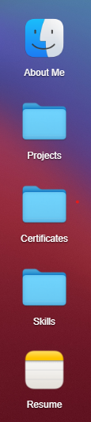

1. **About Me**  
   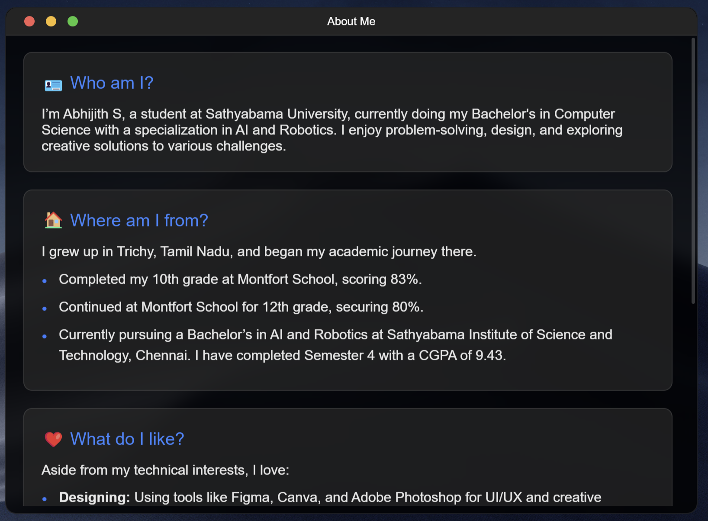  
2. **Projects**  
   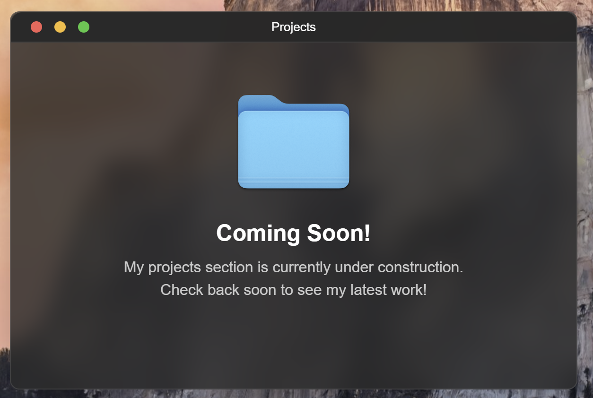  
3. **Certificates**  
   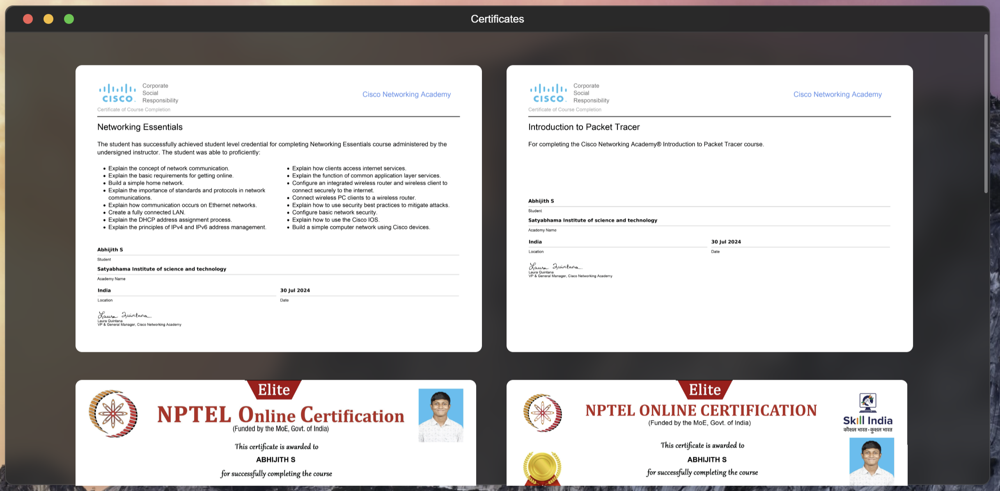  
4. **Skills**  
   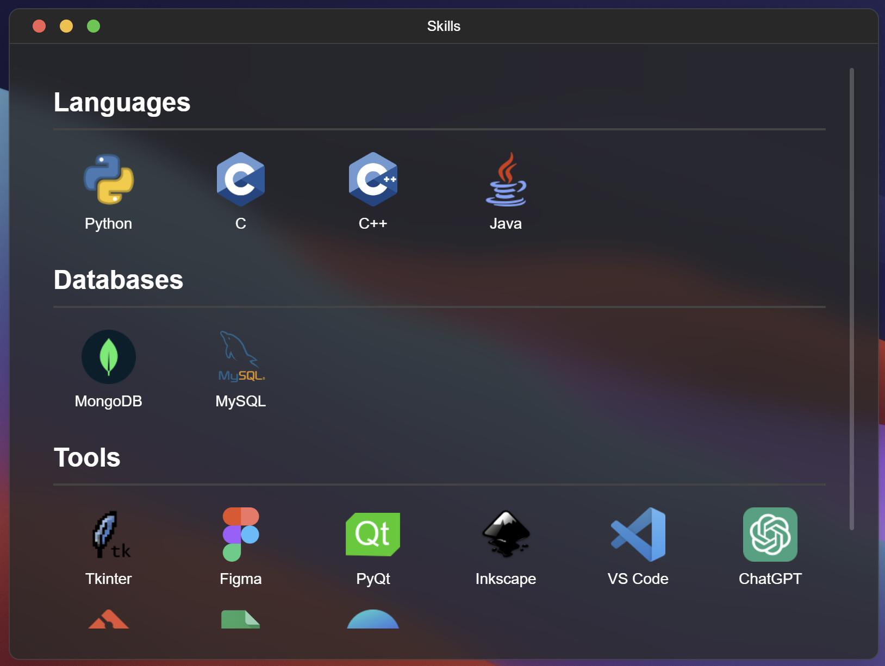  
5. **Resume**  
   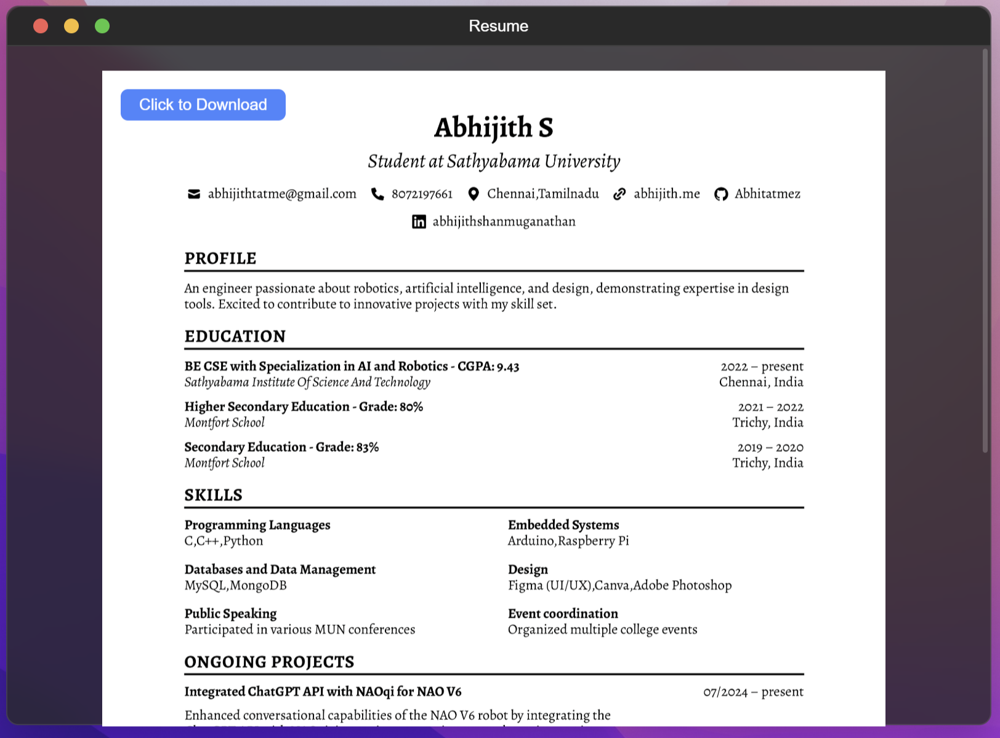  

---

## 📌 Taskbar
The **Taskbar** provides quick access to my professional and social platforms:  
- **GitHub**  
- **LinkedIn**  
- **LeetCode**  
- **CodeChef**  
- **HackerRank**  
- **Gmail**  
- **Twitter**  

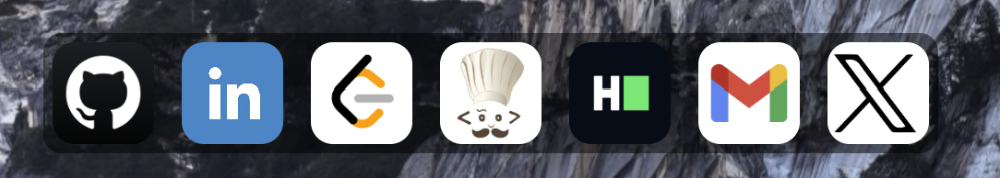

These icons allow you to explore my work and get in touch with me directly.

---

## ✨ Features
This portfolio boasts several dynamic features, designed to enhance user interaction and customization:

1. **Draggable Icons Slider**: Enable or disable the icon dragging functionality for a personalized experience.  
2. **Dark/Light Theme Selector**: Easily switch between dark and light themes for your viewing comfort.  
3. **Smooth Grid Locking**: Icons lock onto a grid with a smooth animation after being dragged.  
4. **macOS-Style Window Controls**: Includes intuitive maximize, minimize, and close buttons in the top-left corner.  
5. **Window Layering**: New windows always appear on top, ensuring easy access.  
6. **Rotating Wallpaper**: Dynamic wallpapers that rotate in a cycle for visual variety.  
7. **Adaptive Window Colors**: Window colors adjust based on the selected theme (light or dark).  
8. **Draggable Windows**: All windows are draggable, allowing flexible customization of your workspace.

---

